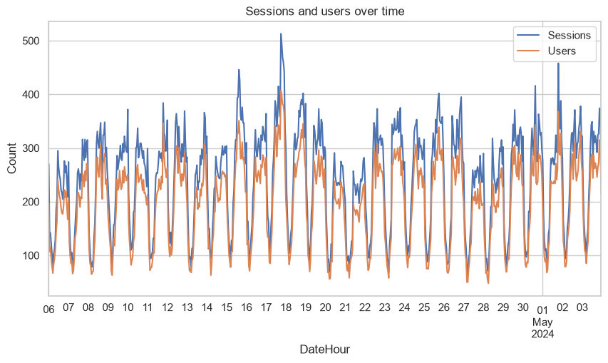
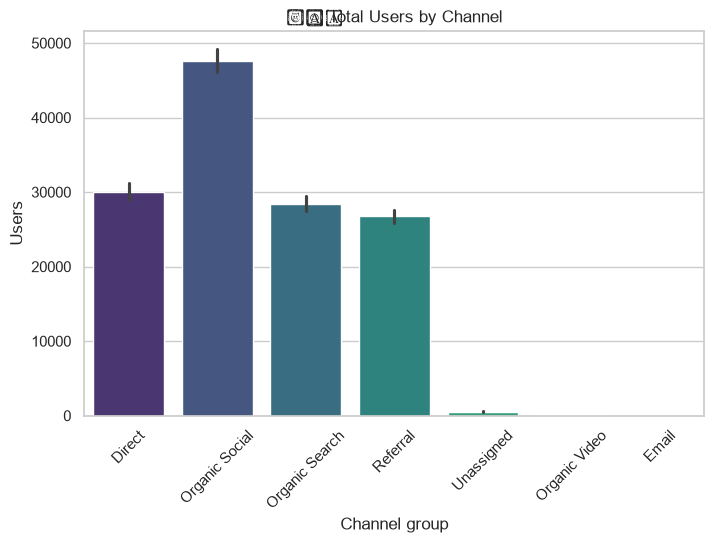
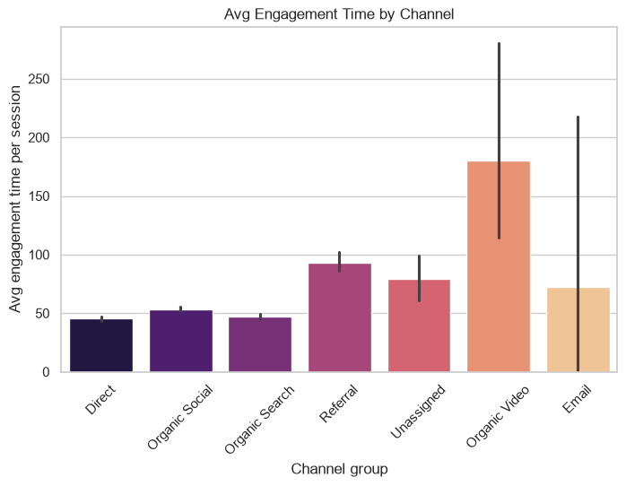
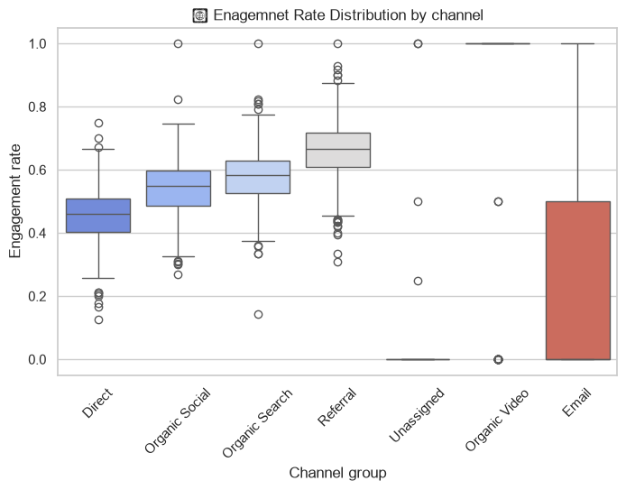
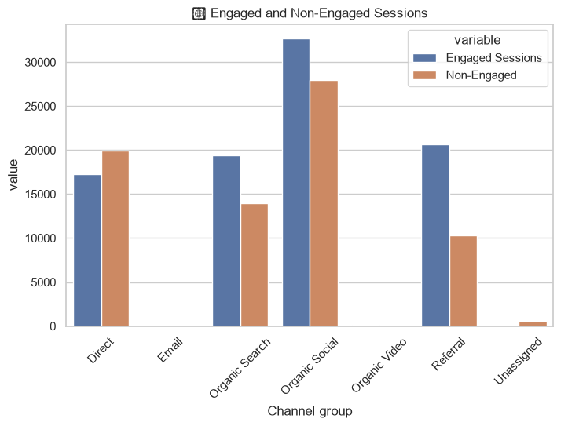
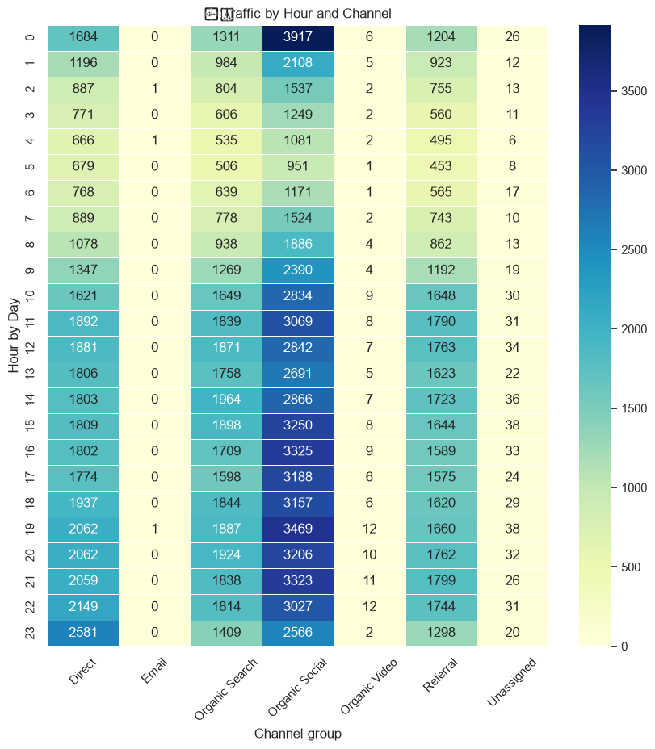
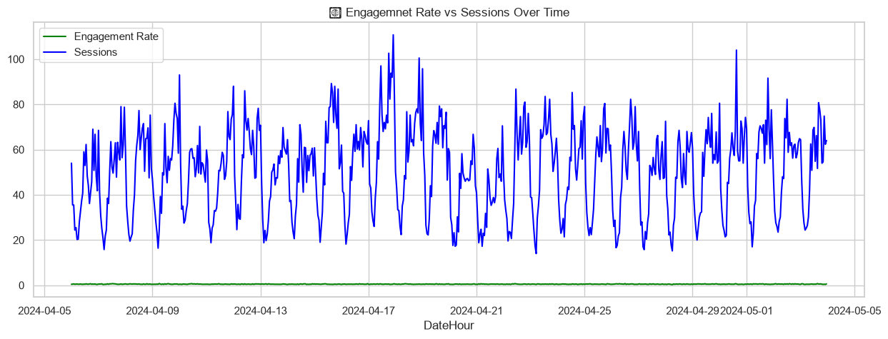

# 📊 Website Performance Analysis

Analysis of hourly website traffic and engagement data across acquisition channels, using Python for data cleaning, exploratory data analysis, and visualization.


---

## 👤 Author

**Pratik Kumar Prajapati**
B.Tech, Computer Science & Engineering 
Focusing on Data Analyst

[](https://github.com/pikuwa)
[](https://www.linkedin.com/in/pratikxdev)

---

## 📌 Project Overview

This project analyzes hourly website performance data (in the style of a Google Analytics 4 export) to understand **how users arrive at a site, how engaged they are, and when traffic peaks**. The goal was to take a raw, messily-formatted export and turn it into clean, decision-ready insights on channel performance and user behavior patterns.

**Objectives:**
- Clean and structure a raw multi-header analytics export into an analysis-ready dataset
- Compare acquisition channels (Direct, Organic Social, Organic Search, Referral, Email, etc.) on volume *and* quality of traffic
- Identify time-based traffic and engagement patterns across the day
- Surface actionable insights on where traffic is strong vs. where it under-delivers

---

## 🗂️ Dataset

Hourly website traffic data with the following fields:

| Column | Description |
|---|---|
| `Channel group` | Acquisition channel (Direct, Organic Social, Organic Search, Referral, Email, Organic Video, Unassigned) |
| `DateHour` | Date + hour of the record |
| `Users` | Unique users in that hour |
| `Sessions` | Total sessions in that hour |
| `Engaged Sessions` | Sessions with meaningful interaction |
| `Avg engagement time per session` | Average active time per session (seconds) |
| `Engaged sessions per user` | Engagement ratio per user |
| `Events per session` | Average events triggered per session |
| `Engagement rate` | Share of sessions that were engaged |
| `Event count` | Total events in that hour |

**Size:** 3,182 hourly records spanning **April 6 – May 3, 2024** (~4 weeks).

---

## 🛠️ Tools & Technologies

- **Python** — core language
- **Pandas / NumPy** — data cleaning, wrangling, aggregation
- **Matplotlib / Seaborn** — data visualization
- **Jupyter Notebook** — analysis environment

---

## 🧹 Data Cleaning & Preparation

The raw export shipped with a broken two-row header and text-typed numeric fields, so the notebook:

1. Rebuilt clean column names from the malformed header row
2. Parsed `DateHour` (format `YYYYMMDDHH`) into proper `datetime` objects
3. Coerced all metric columns to numeric types, handling parsing errors safely
4. Engineered an `Hour` feature from the timestamp to enable time-of-day analysis
5. Validated the cleaned dataset with `.info()` and `.describe()` — **3,182 non-null rows across 11 columns**, zero missing values after cleaning

**Dataset summary (post-cleaning):**

| Metric | Mean | Min | Max |
|---|---|---|---|
| Users / hour | 41.9 | 0 | 237 |
| Sessions / hour | 51.2 | 1 | 300 |
| Engagement rate | 50.3% | 0% | 100% |
| Events / session | 4.68 | 1.0 | 56.0 |

---

## 📈 Exploratory Data Analysis

### 1. Sessions & Users Over Time


Traffic follows a **strong, repeating daily cycle** rather than a trend — sessions swing from lows of ~50 to peaks of 300–500 every single day across the full 4-week window, with sessions consistently tracking above users (as expected, since one user can open multiple sessions).

### 2. Total Users by Channel


**Organic Social is the dominant acquisition channel** (~48K users), ahead of Direct (~30K), Organic Search (~28K), and Referral (~27K). Organic Video, Email, and Unassigned contribute negligible volume in this dataset.

### 3. Average Engagement Time by Channel


Organic Video and Email show the highest average engagement time, but from a very small sample (wide confidence intervals) — not yet reliable signals. Among the high-volume channels, **Referral sessions run longest** (~93s avg), notably ahead of Direct, Organic Social, and Organic Search (45–55s).

### 4. Engagement Rate Distribution by Channel


**Referral traffic has the best engagement quality** of any high-volume channel (median ~65–68%), followed by Organic Search and Organic Social (~55–58%). **Direct has the lowest median engagement rate (~45%)** despite being the second-largest channel by volume.

### 5. Engaged vs. Non-Engaged Sessions


This confirms the pattern above: **Direct is the only major channel where non-engaged sessions outnumber engaged ones**, while Organic Search, Organic Social, and especially Referral skew toward engaged sessions.

### 6. Traffic by Hour and Channel


A clear diurnal rhythm emerges across **every** channel: traffic bottoms out between roughly **2–6 AM** and climbs steadily to a peak in the **9 PM–midnight** window. Organic Social shows the sharpest peak, hitting nearly 3,900 sessions at midnight — more than double its early-morning low.

### 7. Engagement Rate vs. Sessions Over Time


Despite session volume swinging by 5–10x within a single day, the **engagement rate stays remarkably flat around 50%** throughout the entire period — traffic quality holds steady even during high-volume hours, suggesting the site handles peak demand without a drop-off in visitor engagement.

---

## 💡 Key Findings

- **Organic Social drives the most traffic, but Referral drives the best traffic** — highest engagement rate and longest sessions among high-volume channels.
- **Direct traffic is a volume channel, not a quality channel** — it's the only major source where most sessions are non-engaged, worth investigating further (bookmarks, app traffic, or brand searches misattributed as Direct).
- **Traffic is highly time-of-day dependent**, peaking in the evening and troughing overnight — useful for scheduling content pushes, campaigns, or server capacity planning.
- **Engagement quality is stable and volume-independent**, indicating the site experience doesn't degrade under peak load.

---

## 🧠 Skills Demonstrated

- Data cleaning & wrangling of a messy, real-world analytics export (Pandas)
- Feature engineering (datetime parsing, hour extraction)
- Exploratory data analysis & statistical summarization
- Multi-chart visualization design (line, bar, box plot, grouped bar, heatmap) with Matplotlib/Seaborn
- Translating raw metrics into channel-level and time-based business insights

---

## 📁 Repository Structure

```
├── README.md
├── Website_Performance_Analysis_project.ipynb
├── website_Performance_Analysis_report.docx
└── images/
    ├── 01_sessions_users_over_time.png
    ├── 02_total_users_by_channel.png
    ├── 03_avg_engagement_time_by_channel.png
    ├── 04_engagement_rate_distribution.png
    ├── 05_engaged_vs_nonengaged_sessions.png
    ├── 06_traffic_heatmap_hour_channel.png
    └── 07_engagement_rate_vs_sessions.png
```

## ▶️ How to Run

```bash
pip install pandas numpy matplotlib seaborn jupyter
jupyter notebook Website_Performance_Analysis_project.ipynb
```

---

## 📬 Connect

- GitHub: [github.com/pikuwa](https://github.com/pikuwa)
- LinkedIn: [linkedin.com/in/pratikxdev](https://www.linkedin.com/in/pratikxdev)
